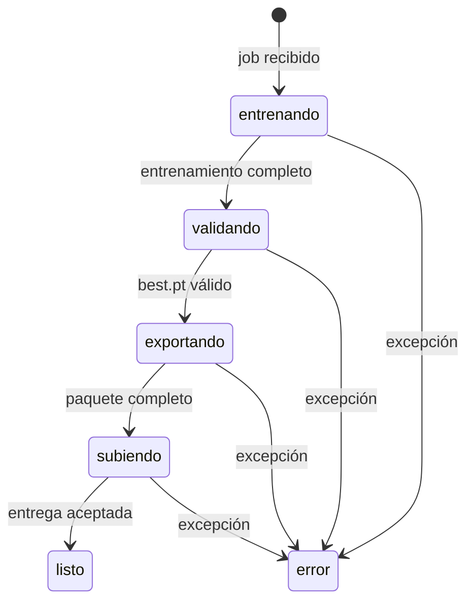

# Contexto: ejecución remota de entrenamientos

## Propósito

TrainBridge permite que un operador use una máquina con GPU como worker intercambiable para
convertir un dataset revisado en un modelo validado y exportado, con progreso visible en el sistema
que solicitó el trabajo.

## Alcance y límites

- Incluye: polling, descarga del dataset, entrenamiento, validación, exportación, empaquetado,
  entrega y recuperación posterior al entrenamiento.
- No incluye: creación y revisión del dataset, persistencia de la cola, API receptora propia ni
  despliegue final del modelo.
- Integraciones: servidor externo de revisión/cola, Ultralytics, PyTorch y OpenVINO.

`CONTEXTO.md` explica el caso de uso inicial con Frigate; este archivo gobierna las reglas generales
de TrainBridge.

## Vocabulario

| Término | Significado | No confundir con |
| --- | --- | --- |
| Campaña | Nombre legible que agrupa corridas relacionadas | ID único de un job |
| Job | Solicitud remota concreta de entrenamiento | Proceso worker permanente |
| Run | Salida local de Ultralytics para un job | Campaña completa |
| Modelo base | Peso reutilizable desde el que parte el entrenamiento | Modelo exportado resultante |
| Recuperación | Finalizar desde `best.pt` sin repetir épocas | Reanudar épocas interrumpidas |

## Actores y permisos

| Actor | Puede | No puede desde este repo | Evidencia |
| --- | --- | --- | --- |
| Operador del worker | Configurar, iniciar, detener y recuperar jobs | Administrar reglas del servidor | Scripts y CLI |
| Servidor solicitante | Entregar jobs/datasets y recibir reportes/modelos | Ejecutar código local directamente | Cliente en `runner.py` |
| Worker | Usar el token configurado para el contrato consumido | Decidir autorización remota | `api_request` |

El token autentica solicitudes salientes. Roles, expiración, scopes y propiedad remota son
`NOT_EVALUATED` porque pertenecen al servidor externo.

## Estado y artefactos relevantes

- Payload del job: estado efímero recibido por HTTP con ID, campaña, épocas y modelo base.
- Dataset: instantánea local inmutable en intención para esa ejecución; el directorio se reemplaza
  si el mismo job vuelve a descargarse.
- Run: checkpoints y resultados de Ultralytics.
- Exportación: OpenVINO, `labels.txt` y `metadata.json` entregables.

No existe base de datos local ni schema persistente en este repositorio.

## Estados emitidos y flujo

| Estado emitido | Momento | Condición | Efecto local o remoto |
| --- | --- | --- | --- |
| `entrenando` | Descarga y épocas | Job aceptado por el loop | Dataset y run local |
| `validando` | Evaluación de `best.pt` | Existe checkpoint | Métricas de validación |
| `exportando` | Conversión OpenVINO | Validación iniciada o recuperación | Exportación local |
| `subiendo` | Entrega del paquete | Exportación completa | POST del tar |
| `listo` | Cierre exitoso | Subida sin excepción | Resultado y bloque Frigate reportados |
| `error` | Excepción del job | Cualquier etapa falla | Error reportado; worker continúa |

Estos son estados enviados por el cliente, no una afirmación sobre la máquina de estados aceptada
por el servidor. Durante entrenamiento se reportan además época actual y total.

## Reglas de negocio

1. Campaña, ID de job y nombre del peso base deben ser segmentos seguros antes de construir rutas.
2. Cada job escribe bajo campaña e ID para conservar trazabilidad y evitar colisiones entre corridas.
3. El dataset debe contener `dataset.yaml`, `train`, `val`, `names` y las cuatro carpetas YOLO; su
   `path` se normaliza a la ruta absoluta del worker.
4. Un entrenamiento exitoso requiere `weights/best.pt`; no se exporta silenciosamente otro peso.
5. La entrega incluye exactamente un XML OpenVINO, labels consecutivos y metadatos de procedencia.
6. Un fallo de reporte de progreso no cancela por sí solo el cómputo; un fallo en la entrega sí
   impide marcar localmente el flujo como terminado.
7. La recuperación exige dataset y `best.pt`; no reanuda ni repite las épocas.
8. No deben ejecutarse concurrentemente dos procesos sobre la misma combinación campaña/job.

## Interfaces y secuencia

- Entrada automática: operaciones consumidas de `docs/api.md`.
- Entrada manual: comandos de `docs/cli.md`.
- Secuencia: descargar → entrenar → validar → exportar → inspeccionar → empaquetar → subir → reportar.
- Salida: artefactos locales versionados por job y paquete remoto.

## Errores y recuperación

| Situación | Comportamiento | Recuperación |
| --- | --- | --- |
| Servidor temporalmente inaccesible en polling | Registrar y volver a intentar tras el intervalo | Restablecer conectividad |
| Dataset inválido | Fallar antes de entrenar y reportar error | Corregir exportación y encolar otro job |
| Error durante entrenamiento | Conservar lo escrito por Ultralytics y continuar el loop | Diagnosticar; reanudar no está implementado |
| Fallo posterior con `best.pt` | Reportar error | Ejecutar `--finalizar-job` |
| Exportación ambigua | Rechazar si no hay exactamente un XML | Revisar versión y salida de OpenVINO |

## Pruebas mínimas

1. Dataset válido: normaliza la raíz y conserva train/val.
2. Entrada hostil: segmentos con escape de directorio son rechazados.
3. Dataset incompleto: falla antes de invocar entrenamiento.
4. Labels: índices consecutivos producen el archivo esperado.
5. Modelo base legado: se migra a la raíz administrada.

Estas pruebas existen en `tests/test_runner.py`. El ciclo HTTP/GPU completo sigue pendiente de una
prueba controlada.

## Decisiones recientes

| Fecha | Decisión | Motivo | Consecuencia |
| --- | --- | --- | --- |
| 2026-09-24 | Adoptar TrainBridge como nombre | Generalizar el worker para otros proyectos | El caso Frigate pasa a ser la primera integración |
| 2026-09-24 | Separar artefactos por campaña y job | Trazabilidad y corridas repetidas | Las rutas incluyen ambos segmentos |
| 2026-09-24 | Administrar pesos base y exportaciones | Evitar archivos sueltos y mezclar resultados | Se usan `modelos/base` y `modelos/exportados` |
