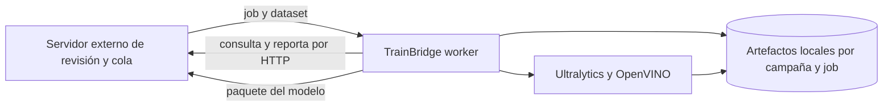

# Arquitectura del proyecto

## Resumen

TrainBridge es un worker autohospedado que convierte una máquina con GPU en ejecutor de trabajos de
entrenamiento. Consulta una cola HTTP externa, descarga una instantánea de dataset, entrena y valida
con Ultralytics, exporta a OpenVINO y devuelve el paquete al sistema solicitante.

El repositorio conserva estado de trabajo solo en el filesystem local. No contiene el servidor de
cola, la herramienta de revisión, una base de datos ni el despliegue final en Frigate. Una API que
reciba solicitudes directamente es una dirección futura descrita en README, no un componente actual.

## Stack actual

| Capacidad | Tecnología fijada | Responsabilidad | Evidencia |
| --- | --- | --- | --- |
| Runtime | Python 3 | Worker, CLI y tests | Scripts y archivos `.py` |
| Entrenamiento | Ultralytics 8.4.162 | Entrenar, validar y exportar YOLO | `requirements.txt` |
| Cómputo GPU | PyTorch 2.11.0 CUDA 12.8 | Ejecución acelerada | `requirements.txt` |
| Exportación | OpenVINO 2026.4.0 | Modelo consumible por el NUC | `requirements.txt` |
| Transporte | `urllib.request` y tar/gzip | Consumir cola y transferir artefactos | `runner.py` |

## Componentes y fronteras

| Componente | Tipo | Responsabilidad | Entrada y salida | Ubicación |
| --- | --- | --- | --- | --- |
| Worker | Proceso | Orquestar el ciclo del job | Job HTTP a estado y modelo | `runner.py` |
| Inspector | Módulo y CLI | Leer tensor OpenVINO | XML a metadatos Frigate | `inspect_model.py` |
| Adaptadores de plataforma | Scripts | Crear venv y lanzar worker | Host a proceso Python | `scripts/` |
| Servidor de revisión/cola | Sistema externo | Encolar, exportar dataset y recibir modelo | HTTP | Fuera del repo |
| Ultralytics y OpenVINO | Librerías externas | Entrenamiento y exportación | Dataset a modelo | `requirements.txt` |



## Dirección de dependencias

| Desde | Puede depender de | No debe depender de | Motivo |
| --- | --- | --- | --- |
| Scripts de plataforma | Entry points Python y venv | Lógica de entrenamiento duplicada | Paridad entre sistemas |
| `runner.py` | Inspector y librerías externas | Código del servidor remoto | Worker desplegable independiente |
| `inspect_model.py` | OpenVINO | Estado de la cola | Reutilización como CLI |
| Tests | Módulos locales y mocks | Red, GPU o datos reales | Pruebas seguras y reproducibles |

## Mapa de carpetas

```text
trainbridge/
├── runner.py             # Worker y CLI de recuperación
├── inspect_model.py      # Inspección OpenVINO
├── scripts/              # Setup, arranque y validador documental
├── tests/                # Pruebas unitarias
├── datasets/             # Instantáneas ignoradas, salvo su README
├── runs/                 # Salidas de entrenamiento ignoradas
├── modelos/              # Pesos base y exportaciones ignorados
└── docs/                 # Memoria viva y contratos
```

## Flujo global

1. El worker obtiene del servidor externo el siguiente job disponible.
2. Valida campaña e ID, descarga un tar y normaliza `dataset.yaml` a la ruta local exacta.
3. Obtiene o reutiliza el peso base administrado bajo `modelos/base/`.
4. Ultralytics entrena en `runs/<campana>/<job-id>/` y reporta progreso por época.
5. El mejor checkpoint se valida y exporta a OpenVINO.
6. El inspector genera metadatos y el worker crea labels y procedencia bajo
   `modelos/exportados/<campana>/<job-id>/`.
7. El paquete se sube y el job se reporta como listo; una excepción se reporta como error y el loop
   continúa.

El contrato de transporte está en `docs/api.md`; estados y reglas del trabajo, en `context.md`.

## Decisiones y restricciones

| Decisión | Motivo | Consecuencia | Evidencia |
| --- | --- | --- | --- |
| Polling saliente | Evitar puertos entrantes en workers | Latencia máxima aproximada de 5 s en reposo | `runner.py` |
| Artefactos por campaña y job | Trazabilidad y evitar colisiones | Requiere ambos segmentos válidos | `runner.py` |
| Pesos base administrados | Evitar descargas y archivos sueltos | Se guardan en `modelos/base/` | `preparar_modelo_base` |
| Versiones exactas | Reproducibilidad CUDA y exportación | Actualizaciones son deliberadas | `requirements.txt` |
| Despliegue manual | Validación incremental en el consumidor | TrainBridge no modifica Frigate | README y `CONTEXTO.md` |
